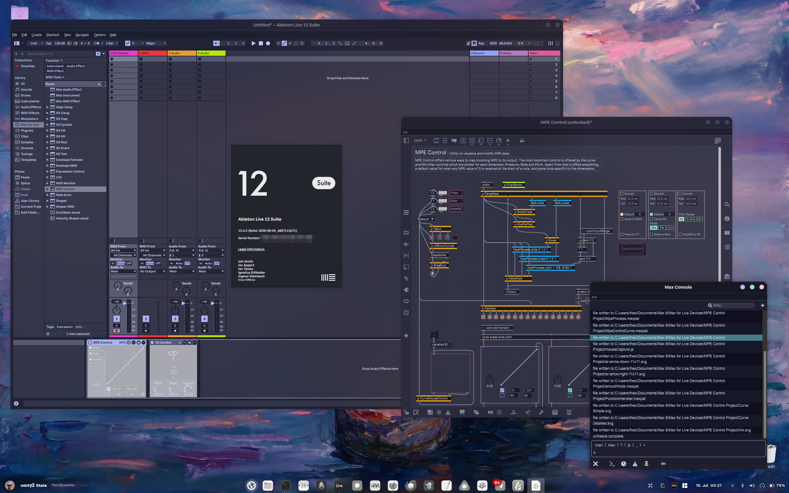

# Ableton Live 12 on Linux

Ableton Live 12 on a patched Wine: reproducible builds, a single-file installer, and a beta test program with remote diagnostics.




## Features

- Live 12 Suite and Beta support
- Push 1 + 2 support.
- Device recovery — audio and MIDI devices (Push included) survive in-session disconnect and replug.
- Max/MSP and Max for Live support.
- Native file dialogs including open/save dialogs are your desktop's (XDG portal).
- Dark/light theme mode follows the system setting.
- System font support, Ableton's UI renders with your desktop's fonts.
- Low-latency audio via autobuilt WineASIO → JACK/PipeWire at 256 frames, with additional hardening to prevent crashes.
- VST3/JUCE/OpenGL editor windows render, take input, and scale correctly.
- HiDPI support display scale auto-detected and recalibrated on every launch.
- Extensions SDK support.
- VST specific fixes for Autuira, Pianoteq, SWAM and KORG (with others to follow).
- Reproducible builds.

## Getting started

1. Download Ableton Live
2. Download a release from the Releases tab
3. If your Ableton archive is in the same place, run the downloaded installer script and follow the instructions.

## First launch

A few more things to do after you launch for the first time:

1. Ableton's Settings → untick Auto-Scale Plugin Window (prevents a plugin-window resize loop).
2. Preferences → Audio → Driver Type ASIO → Device WineASIO.

## Push 1 + 2 support

This is built in. Use Preferences → Link, Tempo & MIDI → exactly one `Push2` row, Live Port for both input and output. Like all other MIDI and Audio devices, Push will survive in-session disconnects. 


## Development

Requirements are:

- `podman` or `docker`
- ~10 GB disk.
- x86_64, glibc 2.35+ (any 2022+ distro)
- GNOME or KDE 
- `zstd`
- `pipewire-jack`
- `cabextract`,
- `binutils`

## Project structure

- [patches/](patches/): the Wine patch series + the wineasio series
- [scripts/](scripts/): install, prefix setup, launcher
- [vendor/](vendor/): pinned build inputs
- [notes/](notes/): patch notes and investigations
- [tools/](tools/): diagnostic tools
- [bin/](bin/): launchers
- [dist/](dist/): build outputs
- [beta/](beta/): beta test program

## Install

If you're working on this and want to try building and installing:

```bash
./build.sh
./scripts/install.sh
./scripts/setup-prefix.sh
WINEPREFIX=~/.wine-ableton ~/.local/opt/wine-d2d1-nspa-11.11/bin/wine \
    "/path/to/Ableton Live 12 Suite Installer.exe"
ableton-live
```

## Single-file installer

`./scripts/make-installer.sh` compiles everything into `dist/ableton-wine-setup-<version>.run`. Put it on a USB stick next to your Ableton download (`.zip` or `.exe`) and run it on the target machine:

```bash
sh /run/media/*/*/ableton-wine-setup-*.run
```

It verifies itself, installs the runtime, detects the display scale, creates the prefix, then runs the Ableton installer it finds next to itself (pauses so you can add one; prints the manual commands otherwise). 

## Display scale

`setup-prefix.sh` and the launcher auto-detect the display scale (GNOME, KDE, sway, Hyprland, X11 `Xft.dpi`); the launcher recalibrates the prefix DPI on every start, so switching monitors needs only a Live restart. Only 100% and 125% are calibrated; anything else is preserved. Override with `ABLETON_DPI_MODE`.

## Environment variables

- `ABLETON_WINE_ROOT` — runtime path (default `~/.local/opt/wine-d2d1-nspa-11.11`)
- `ABLETON_WINEPREFIX` — prefix path (default `~/.wine-ableton`)
- `ABLETON_DPI_MODE` — `auto` | `preserve` | `100` | `fractional`
- `ENGINE=docker` — for `build.sh` / `make-installer.sh`

## Steam Deck

Desktop Mode only. Add the host packages once, and again after every SteamOS update (updates remove pacman packages; runtime, prefix, and Live live in `/home` and survive):

```bash
sudo steamos-readonly disable
sudo pacman-key --init && sudo pacman-key --populate archlinux holo
sudo pacman -S cabextract binutils pipewire-jack
sudo steamos-readonly enable
```

## Troubleshooting

| Symptom | Fix |
|---|---|
| WineASIO missing from Live's device list | install `pipewire-jack`, restart Live |
| Live hangs/crashes at startup opening audio | needs build `2026.07.13.3`+ (`ABLETON-WINE-BUILD-INFO.txt` in the runtime); still failing → run `./scripts/check-live-audio.sh` and report |
| Crackling / dropouts | WineASIO panel → buffer 512 |
| No hardware MIDI in Live | re-run `./scripts/install.sh` with a current tarball, restart Live |
| File dialogs look like Windows 95 | install your desktop's `xdg-desktop-portal`; 32-bit programs always get the Wine dialog |
| Windows resize endlessly / wrong UI size | restart Live (the launcher re-detects DPI); if it persists, re-run `setup-prefix.sh` with an explicit `ABLETON_DPI_MODE` |
| `install.sh` says the runtime is in use | close Live, wait a few seconds, retry |

## More

[patches/BASE.txt](patches/BASE.txt) — origin of every Wine change.

[cade@parare.al](mailto:cade@parare.al)
