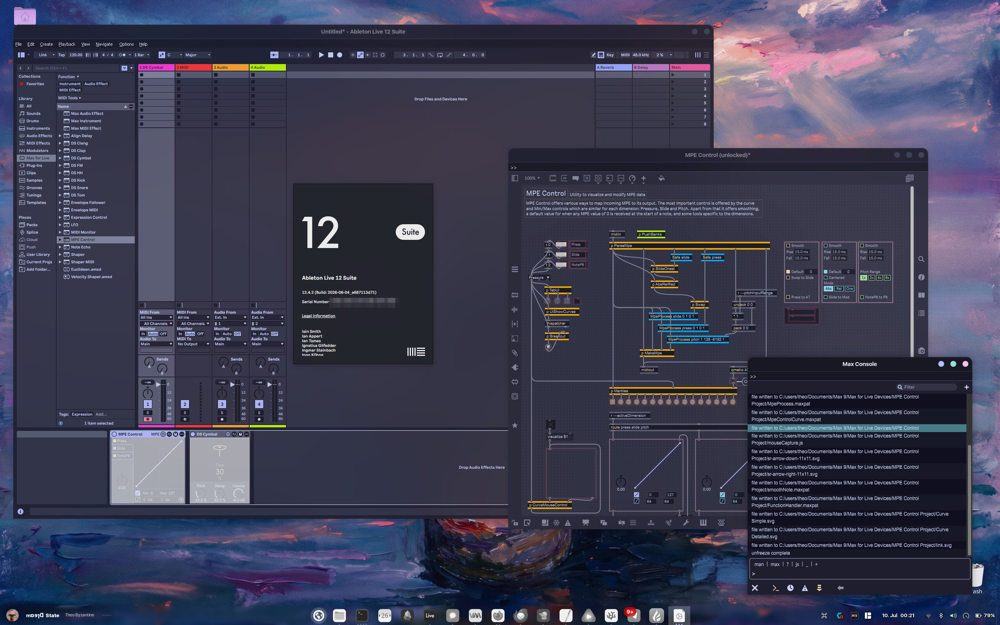

# Ableton Live on Linux



Produce and perform with Ableton Live on a self-sovereign, open-source
stack. This project makes the popular Berlin-based DAW and its ecosystem of 
products a first-class Linux citizen, with zero compromises.

It is also absolutely **not affiliated with or endorsed in any way by Ableton
AG** and respects the Ableton terms of service.

[Download the latest installer](https://github.com/shibco/ableton-linux/releases/latest/download/install-ableton-latest.run)

Follow the project on [Bluesky](https://bsky.app/profile/wires.sh) to stay up to date.

## Features

This project fully supports the full set of Ableton's offering:

   - **Software:**
      - **Live 12** - Intro, Standard, Suite, Lite and Trial
      - **Live 11** - Intro, Standard, Suite, Lite and Trial
      - **Cycling '74** - Max 8, Max 9 and Max for Live (Live 11 and 12)
      - **Live 12+ Beta**
      - **Splice integration**
      - **Ableton Cloud**
      - **Ableton Link**
      - **Extensions SDK**
   - **Hardware:**
      - **Push 1**
      - **Push 2**
      - **Push 3**

_**Ableton Move** support is coming soon._

In the pursuit of making Linux the uncontested ideal home for Ableton Live in 2026 and beyond,
the Ableton-Linux runtime offers a complete set of features for real-world, everyday
use in amateur, production, professional and live settings:

- Automatic recovery when in-use audio hardware or startup-detected MIDI
  controllers briefly disconnect
- Low-latency PipeASIO audio for live performance
- Linux desktop integration with native file types and dialogs, advanced font rendering
  and reuse of your own desktop fonts in application windows
- Automatic light and dark desktop theme detection
- No-fuss support for desktop resolutions, HiDPI displays, and fractional scaling
- Fixes for VST-specific display, audio, and stability problems
- Extensive optimisations to make Live and Max start up and run faster, use less resources
  and behave with greater stability than their Windows or macOS counterparts
- Dozens of nice-to-haves, quality-of-life fixes, and other polish
- Auditable builds with pinned inputs, checksum verification, and public documentation

We also have a separate, early AArch64 build for Apple Silicon computers that
run Asahi Linux.

## Installation

### Requirements

The main installer needs an x86-64 Linux system that meets Ableton Live's
hardware requirements.

Additionally, you need:

- glibc 2.35 or newer
- PipeWire 1.4.2 or newer
- [Linux 6.14 or newer with NTSync enabled](TROUBLESHOOTING.md#enable-and-verify-ntsync)
- GStreamer with its base and good plugin sets
- GNU coreutils, `tar`, `zstd`, and `flock`
- your installation files and activation details from Ableton

For most people, a modern and up-to-date Linux distribution, such as SteamOS,
Ubuntu, CachyOS, or Arch, will already fulfil the userspace requirements.
NTSync kernel support varies between distributions. Some systems need a newer
kernel package or a manual module load.

Some distros - such as Debian 12, Linux Mint, and Pop!_OS 24.04 and earlier - 
ship an older version of the Linux audio system, Pipewire. If you are running
one of these distros, you will need to update Pipewire before installing Ableton Live 
on Linux. [We have a guide for doing this](TROUBLESHOOTING.md#the-installer-says-pipewire-is-too-old),
to help you get going.

### Getting started

Even if you are new to Linux, getting Ableton Live to run on Linux is usually
straightforward:

1. Download the Ableton Live installation ZIP from Ableton.com.
2. Download [the latest version of our installer](https://github.com/shibco/ableton-linux/releases/latest/download/install-ableton-latest.run).
3. Double-click the `install-ableton-latest.run` file.

You can also run the installer from the terminal.

   ```bash
   sh ~/Downloads/install-ableton-latest.run install
   ```

If you have a few different Ableton Live installers on your computer, you
can specify one to install by pointing the installer at it with the `--live-installer`
flag:

   ```bash
   sh ~/Downloads/install-ableton-latest.run install \
     --live-installer "$HOME/Downloads/Ableton Live 12 Installer.zip"
   ```

For best results, double-check the name of the Ableton installer you have downloaded. 
If you run the installer by itself without explicitly pointing to an Ableton Live archive, 
the installer will try to find one in the same directory.

Once started, the install is mostly automatic.

Near the end, the installer may name a program still running in the Wine prefix and ask whether to close it. Pressing Enter leaves it running, which is the safe answer if you also have Max or another Wine program open. Live is already installed by that point, so either answer keeps it.

### Running Live

Start Ableton Live the way you normally start applications on your Linux OS.

You can also start Live from the command line. Open a new terminal window, and run this command:

```bash
ableton-live
```

You can also specify a Live Set to quickly open on launch:

```bash
ableton-live "/path/to/Your Set.als"
```

The `ableton-live` command accepts a number of options (called _environment variables_) that change
how it behaves. [We document each of them and their effects](BUILDING.md#current-configuration), but you can
also read about them like this:

```bash
ableton-live --help
```

For more details on how to run Live 11, follow the [Live 11 instructions](#live-11).

### First launch

When you first start Live, you'll need to set up your audio. Go to
**Settings > Audio**, set **Driver Type** to **ASIO**, and set
**Audio Device** to **PipeASIO**.

### Updates

Ableton Live handles its own application updates, but to protect your privacy,
we intentionally designed this project to **not** update itself automatically. 

To get the latest updates and functionality, [find and download the latest release](https://github.com/shibco/ableton-linux/releases/latest),
then from a terminal, use this command:

```bash
sh ~/Downloads/install-ableton-latest.run update
```

The update process will install new fixes and features listed in the release notes 
to your Live Linux environment. Your Live installation, authorization, and projects will
be preserved, but anything related to the Runtime (and Live's settings) may be changed.

### Uninstalling

To remove this project's runtime and desktop integration while keeping Live and
its authorization, just run:

```bash
sh ~/Downloads/install-ableton-latest.run uninstall
```

If you're really nervous, you can ensure your copy of Live and all of your VSTs remain
by adding the extra (redundant) flag: 

```bash
sh ~/Downloads/install-ableton-latest.run uninstall --keep-prefix
```

To get rid of everything, including Live, its authorization, and any third-party plugins:

```bash
sh ~/Downloads/install-ableton-latest.run uninstall --delete-prefix
```

### Other functionality 
Our installer supports a range of commands for advanced users or complicated
use cases. To understand what you can do with the installer, take a look at
the [full list of available commands](INSTALLER.md).

## Running different versions of Ableton Live on the same computer

This installer brings Linux compatibility to every edition of Live 11 and 12.
We worked hard on this! You can install one Live 11 edition and one Live 12
edition together.

### Live 12

The installer detects Live 12 from the named Ableton installer file. If it
cannot identify a renamed file, pass `--live-major 12` explicitly.

### Live 11

We support Live 11, but with limited resources, we are choosing to focus on
Live 12 for now. Live 11 works well in most cases, but has seen less testing
than Live 12.

To install Live 11:

1. In your terminal window, tell the installer you want to install Live 11:

   ```bash
   sh ~/Downloads/install-ableton-latest.run install \
     --live-installer "$HOME/Downloads/Ableton Live 11 Installer.zip" \
     --live-major 11
   ```

   The first setup downloads extra Live 11 support files, so it needs internet
   access.

2. After the first launch, complete the
   [one-time Max for Live repair](TROUBLESHOOTING.md#live-11-max-for-live-fails-after-the-first-launch).

3. Before importing WMA or video files, read the
   [Live 11 media limitation](TROUBLESHOOTING.md#live-11-media-files-can-crash-live).

When you run Live from the command line, the launcher will automatically detect
Live 11 if it is the only version installed. If Live 11 and Live 12 are both
installed, the launcher defaults to the newest major version.

To launch a specific version of Live, use `env ABLETON_LIVE_VERSION=11 ableton-live` to specify it. If you install
multiple editions of the same major version, follow the
[launcher troubleshooting](TROUBLESHOOTING.md#the-launcher-finds-more-than-one-live-installation).

## Instruments and Effects

We are working on ensuring compatibility with as many VSTs as possible.
This is an ongoing process, and we will soon launch a compatibility and 
stability table to track requested VSTs and plugins.

There are two ways to install Windows plugins:

### If you have a Windows installer

1. Download your VST's installer.
2. Open a terminal window and run:

   ```bash
   env WINEPREFIX="$HOME/.wine-ableton" \
     "$HOME/.local/opt/wine-d2d1-nspa-11.13/bin/wine" \
     "/path/to/PluginInstaller.exe"
   ```

3. Your installer should install directly into your Ableton environment. By
   default, this is `~/.wine-ableton`.

You can also use the command in step 2 to run patches, software updaters, and
copy-protection tools.

### If you have a VST3 file

You can install Windows `.vst3` bundles by copying them directly into:

```text
~/.wine-ableton/drive_c/Program Files/Common Files/VST3/
```

### If you have a Linux VST or CLAP instrument or effect

We are working on proper Linux VST and CLAP support, but it is not implemented
in this project yet. For now, an
[experimental Carla workflow](TROUBLESHOOTING.md#my-linux-vst-or-clap-plugins-dont-appear-in-live)
can route Linux-native plugins through PipeWire.

## Hardware

This project supports Ableton Push alongside common audio interfaces and MIDI
controllers.

### Ableton Push 1 and 2 setup

1. Connect your Ableton Push.
2. Launch Ableton Live.

Live detects Push 1 automatically.

For Push 2, configure exactly one control-surface row under
**Settings/Preferences > Link, Tempo & MIDI**:

- **Control Surface:** Push2
- **Input:** Ableton Push 2 Live Port
- **Output:** Ableton Push 2 Live Port

Enable the input and output **Remote** switches. See
[Push troubleshooting](TROUBLESHOOTING.md#push-2-does-not-connect) if its
display does not start.

### Ableton Push 3 setup

1. Connect Push 3 with its USB-C cable.
2. On a standalone Push 3, switch the unit to Control Mode.
3. Launch Ableton Live.

Live detects Push 3 and starts its screen and pads automatically. Leave the
control-surface rows empty for Push 3.

The first start can install a firmware update on the Push. If the Push asks for
a restart, switch it off and on once, then start Live again.

See [Push 3 troubleshooting](TROUBLESHOOTING.md#push-3-does-not-start-its-display)
if the display stays dark.

## Ableton Link

Link keeps Live in time with other music software and devices on your local
network. This project sets Link up as a background service that runs while Live
is open.

### Using Link

1. Enable **Show Link Toggle** under
   **Settings/Preferences > Link, Tempo & MIDI**.
2. Enable **Link** in Live's control bar.

Devices on the same local network appear automatically. See
[Link troubleshooting](TROUBLESHOOTING.md#ableton-link-does-not-find-peers) if
no peers appear.

### Choosing when Link runs

When you install Ableton Live, by default we include Link via a custom-designed
system service called `ableton-linkd`. This service starts when you launch Live or Max
and closes when those applications close. This is `session` mode.

During installation, you can change this depending on your own preference. Add
one of these options to any `install` or `update` command:

- `--link=session` runs Link while Live or Max is open. This is the default.
- `--link=always` starts Link after you log in and keeps it running.
- `--link=off` turns Link off and leaves it off your system.

The installer remembers your choice, so an update keeps it until you ask for
something else. 

If you have an active firewall, such as `ufw` or `firewalld`, Link needs a port
opened before it can reach other peers. The installer detects an active firewall
and asks for admin privileges to allow Link through.

### Changing your choice later

You can change your preference for how Link runs on your computer at any time 
without reinstalling.

For example, to run Link when your computer starts: 

```bash
sh ~/Downloads/install-ableton-latest.run link enable --mode=always
```

To turn Link off:

```bash
sh ~/Downloads/install-ableton-latest.run link disable
```

This removes only the Link files, settings, and firewall rule that this project
added. Run `link status` to see whether Link is running.

## Getting help

This project is still in active development. If you run into problems, **do not
think that your problem is too small**. 

Start with the [common troubleshooting steps](TROUBLESHOOTING.md).

If you're still stuck, file an issue [on GitHub](https://github.com/shibco/ableton-linux/issues/new/choose)
or come visit us in the [Ableton on Linux Discord](https://discord.gg/SZ2cQgV7U). 
When you post issues in our `#issues` Discord forum, we sync your posts to GitHub, 
to keep our knowledge from being locked away inside a hidden Discord server.

## Development and contributing

We welcome all kinds of contributions. If you've found a fix for a niche VST
or a workaround for a particular environment, please tell us!

Start with:

- [Build from source](BUILDING.md)
- [Implementation notes](notes/)

Contributors must follow the [Code of Conduct](CODE_OF_CONDUCT.md).

## Credits

Maintained by [Cade 'shibco' Diehm](https://shiba.computer/about) and
[Lucas 'ClickSentinel' Gillingham](https://github.com/ClickSentinel), with help from
[trendwhore](https://github.com/trendwhore), 
[jackson-57](https://github.com/jackson-57),
[seebass22](https://github.com/seebass22),
[jttdev](https://github.com/jttdev),
[astrazds](https://github.com/astrazds),
[Version33](https://github.com/Version33),
[Sajattack](https://github.com/sajattack) (for the Aarch64 port work),
[0tanh](https://github.com/0tanh). [yioannides](https://github.com/yioannides)
made the application and MIME icons and [haushaushaus](https://github.com/haushaushaus)
provided the Ableton project and sets we use for benchmarking and testing.

This project is based on the `d2d1-dcomp` stack from 
[giang17/wine](https://github.com/giang17/wine), specifically, we forked
from branch `d2d1-dcomp-11.13` and `5c23dd1c` to continue building our work 
from these solid foundations. _Thank you! <3_ 

ENCORE by [wowitsjack](https://github.com/wowitsjack) informed some early patches.

Questions: [cade@parare.al](mailto:cade@parare.al)

## AI Disclosure

This project uses open-source local models Qwen 3.8 and Kimi K3 to assist with diagnosis, research, QA, documentation review, and build scripts. We will not accept fully-vibecoded contributions as the risk of regression is too high.
